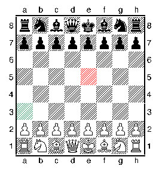
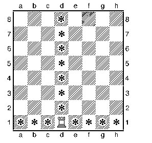
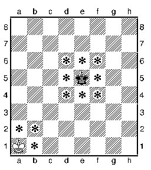
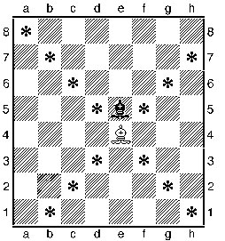
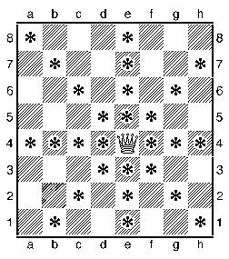
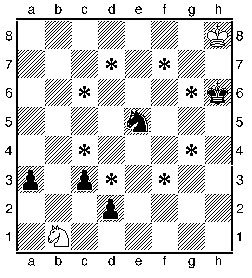
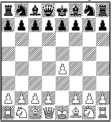

# Ruby Chess

A TDD command-line chess game built in Ruby.

## Goals
- Two-player CLI chess game
- Validates legal moves
- Detects check/checkmate
- Save/load functionality
- Disciplined Git and testing workflow

## Minimum Playable Version of Chess

### Objective
Place the opponent's king under attack with no legal move to escape (checkmate).

### Basic Rules

#### Initial Position
White is on right!
Queen always goes on her color
First row: rook, knight, bishop, queen, king, bishop, knight, rook
Second row: pawns

#### Players & Turns:
- Two players (white and black)
- White moves first
- Players alternate turns

#### Pieces:
Each side begins with:
- 1 King
- 1 Queen
- 2 Rooks
- 2 Bishops
- 2 Knights
- 8 Pawns

#### Legal Moves:
- A piece does not move through other pieces (except Knight)
- It does not capture its own pieces
- It does not put or leave the player's king in threat of capture (check)

##### Rook

##### King

##### Bishop

##### Queen

##### Knight

##### Pawns
- The pawn does not move backward
- On their first move, pawns can move forward 2 squares, after that they can only move forward one square
- The pawn is the only piece that captures diagonally

### Stretch Goals
- Stalemate
- Castling
- En passant
- Pawn Promotion
- Draw by repetition or 50-move rule
- Play against the Qwerty

_Images sourced from the [U.S. Chess Federation](https://www.uschess.org/index.php/Learn-About-Chess/Learn-to-Play-Chess.html) and used for educational purposes under fair use._
